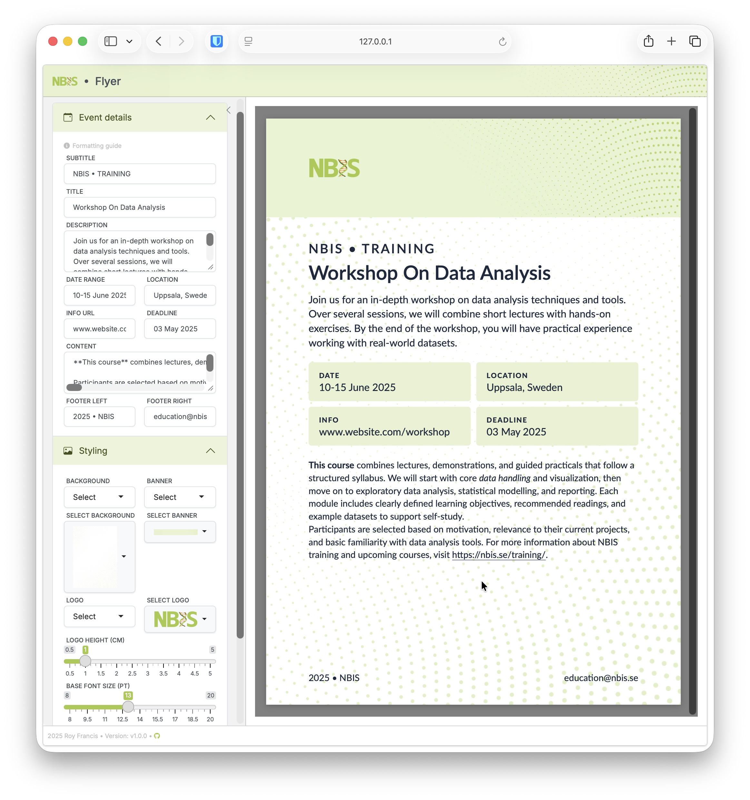

# shiny-flyer

[](https://github.com/royfrancis/shiny-flyer/actions?workflow=ghcr) [](https://github.com/royfrancis/shiny-flyer/actions?workflow=dockerhub) [](https://hub.docker.com/repository/docker/royfrancis/shiny-flyer)

A Shiny/Quarto web app to create NBIS workshop flyers.



## Running the app

### Run online

Click [here](https://flyer.serve.scilifelab.se) to access an online instance of this app. This link may not always be active.

### Run in a docker container

```
docker run --platform=linux/amd64 --rm -p 8787:8787 royfrancis/shiny-flyer:latest
```

The app should be available through a web browser at `http://0.0.0.0:8787`.

### Run in R

Install the following R packages:

```
install.packages(c("shiny","markdown","colourpicker","shinyWidgets","bsicons"))
remotes::install_github("rstudio/bslib")
remotes::install_github("quarto-dev/quarto-r")
```

This repo is not an R package. In the root directory of this repo, run app using `shiny::runApp()`.

## Acknowledgements

This app is built using R, [Shiny](https://shiny.posit.co/), [Quarto](https://quarto.org/) and [Typst](https://typst.app).

---

2026 • Roy Francis
